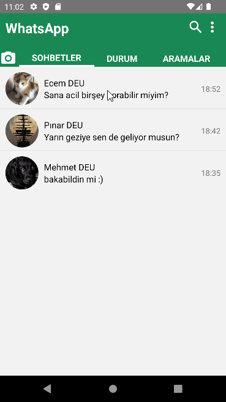

[](https://classroom.github.com/online_ide?assignment_repo_id=8258078&assignment_repo_type=AssignmentRepo)

# WHATSAPP 2022 CLONE

## ABOUT PROJECT
In this project, the Whatsapp's main and messaging pages are redesigned using React Native. The navigation of the pages is provided with "React Navigation". The project makes use of lorem picsum pictures and mock data produced by the developer. MaterialCommunityIcons was used to create the icons. The data for the the receivers and messages are available in .js format in the /src folder.



## INSTALLATION

Clone the project and run the commands below respectively in the terminal.
```
git clone https://github.com/patika-218-akbank-reactnative-bootcamp/assignment-2-Atakanz.git
```

```
cd WhatsApp
```
```
npx react-native start
```
```
npx react-native run-android/ios
```
## TECHNICALITIES

First, the data on the messages.js file is arriving to FirstPage and enter to the FlatList. FlatList is used for creating personal message list cards which are custom components. This custom component is touchable, so the flat list should have a onPress function prop that initiates the personal message pages when pressed. Personal data, messages and time information are passing the other page as route.params and distributed to all necessary sections and custom components (messageboxes-messagePageUnit.js) as well.


